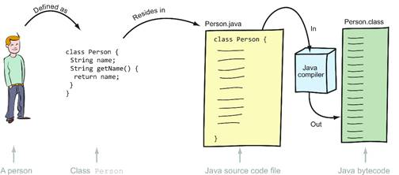
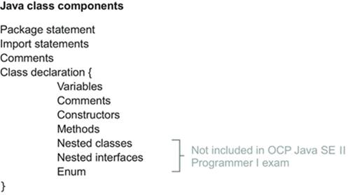

# Java Object-Oriented Approach

## Declare and instantiate Java objects including nested class objects, and explain objects' lifecycles (including creation, dereferencing by reassignment, and garbage collection)

ref.: [Describing objects and classes][objects]

### The structure of a Java class and a source code file

For every exam objective, start with a clear understanding of what’s required from you in the certification exam. For example, try to answer the following query from a certification aspirant: “I come across the term ‘class’ with different meanings, say: class `Person`, Java class defined in Person.java, and class prefix in Person.class. Which of this class is on the exam?” To answer this question, take a look at figure 3.1, which includes the class `Person`, the files Person.java and Person.class, and the relationship between them.



As you can see in figure 3.1, a person can be defined as a class `Person`. This class must reside in a Java source file, say, Person.java (Java source files don’t always match the class names, as we’d cover later in this chapter). Using this Java source code file, the Java compiler (javac.exe on Windows or javac on Mac OS X/Linux/UNIX) generates bytecode (compiled code for the Java Virtual Machine) and stores it in Person.class. The scope of this exam objective is limited to Java classes (class `Person`) and Java source code files (Person.java).

A Java source file, that is, .java file, is used to define all types – classes, interfaces, annotations, enums, and module descriptors.

### Structure of a Java class

The OCP Java SE 11 Programmer I exam will question you on the structure and components of a Java source file and the classes or interfaces that you can define in it. Figure 3.2 shows the components of a Java class file (interfaces are covered in detail in chapter 11).




#### Modules

Introduced in Java 9, modules are used to logically group together a set of cohesive packages and the resources they use, like text, video, or image files. A module is described using a module descriptor, which defines its member packages, dependencies, services and others. If not explicitly defined as part of a module, all Java classes and packages become part of an unnamed or default module. A Java class doesn’t include any line of code that identifies it to be part of a specific module. Java modules are covered in detail in chapter 13.

#### `package` statement

A package lets you group related classes, interfaces and other entities using a common name space. For instance, you know you can find utility classes for working with collections in the package java.util in Java API. A `package` statement is used to explicitly define which package a class is in. If a class includes a `package` statement, it must be the first (non-comment) statement in the class definition and Java source file.

#### `import` statement

Classes and interfaces in the same package can use each other without prefixing their names with the package name. But to use a class or an interface from another package, you must use its fully qualified name, that is, `packageName.anySubpackageName.ClassName`. For example, the fully qualified name of class `ArrayList` is `java.util.ArrayList`. Because using fully qualified names can be tedious and can make your code difficult to read, you can use the `import` statement to use the simple name of a class or interface in your code.

#### Comments

You can add comments in your source file. A comment can appear before and after a `package` statement, within a class definition, or a method definition. Comments come in two flavors: multiline comments and end-of-line comments.

Multiline comments, as the name suggests, span multiple lines of code. They start with `/*` and end with `*/`. Here’s an example:

```java
class MyClass {
    /*
      comments that span multiple
      lines of code
    */
}
```

Multiline comments can contain special characters. Here’s an example:

```java
class MyClass {
    /*
       Multi-line comments with
       special characters &%^*{}|\|:;"'
       ?/>.<,!@#$%^&*()
    */
}
```

In the preceding code, the comments don’t start with an asterisk on every line. But most of the time when you see a multiline comment in a Java source code file (.java file), you’ll notice that it uses an asterisk (`*`) to start the comment in the next line. Please note that this isn’t required—it’s done more for aesthetic reasons. Here’s an example:

```java
class MyClass {
    /*
     * comments that span multiple
     * lines of code
     */
}
```

End-of-line comments start with `//` and, as evident by their name, they’re placed at the end of a line of code or on a blank line. The text between `//` and the end of the line is treated as a comment, which you’d normally use to briefly describe the line of code. Here’s an example:

```java
class Person {
    String fName;    // variable to store Person's first name
    String id;       // a 6 letter id generated by the database
}
```

Though usage of multiline comments in the following code is uncommon, the exam expects you to know that the code is valid:

```java
String name = /* Harry */ "Paul";
System.out.println(name);
```

Here’s what happens if you include multiline comments within quotes while assigning a string value:

```java
String name = "/* Harry */ Paul";
System.out.println(name);
```

When included within double quotes, multiline comments are treated as regular characters and not as comments. So the following code won’t compile because the value assigned to variable `name` is an unclosed string literal value:

```java
String name = "Shre /* ya
                    */ Paul";
System.out.println(name);
```

A comment can precede a package statement.

> Javadoc comments
>
> Javadoc comments are special comments that start with `/**` and end with `*/` in a Java source file. These comments are processed by Javadoc, a JDK tool, to generate API documentation for your Java source code files. To see it in action, compare the API documentation of the class `String` (https://docs.oracle.com/en/java/javase/11/docs/api/java.base/java/lang/String.html) and its source code file (String.java).

#### Class declaration

The class declaration marks the start of a class. It can be as simple as the keyword `class` followed by the name of a class:

```java
class Person {
    //..
    //..
}
```

The declaration of a class is composed of the following parts:

* Access modifiers
* Nonaccess modifiers
* Class name
* Name of the base class, if the class is extending another class
* All implemented interfaces, if the class is implementing any interfaces
* Class body (class fields, methods, constructors), included within a pair of curly braces, `{}`

Don’t worry if you don’t understand this material at this point. We’ll go through these details as we move through the exam preparation.

Let’s look at the components of a class declaration using an example:

```java
public final class Runner extends Person implements Athlete {}
```


| Mandatory | Optional |
| --- | --- |
| Keyword `class` | Access modifier, such as `public` |
| Name of the class | Nonaccess modifier, such as `final` |
| Class body, marked by the opening and closing curly braces, `{}` | Keyword extends together with the name of the base class |
| | Keyword implements together with the names of the interfaces being implemented |

---

## Define and use fields and methods, including instance, static and overloaded methods

---

## Initialize objects and their members using instance and static initialiser statements and constructors

---

## Understand variable scopes, apply encapsulation and make objects immutable

---

## Create and use subclasses and superclasses, including abstract classes

---

## Utilize polymorphism and casting to call methods, differentiate object type versus reference type

---

## Create and use interfaces, identify functional interfaces, and utilize private, static, and default methods

---

## Create and use enumerations

[objects]: https://livebook.manning.com/book/java-se-11-programmer-i-certification-guide/chapter-3/v-3/2
